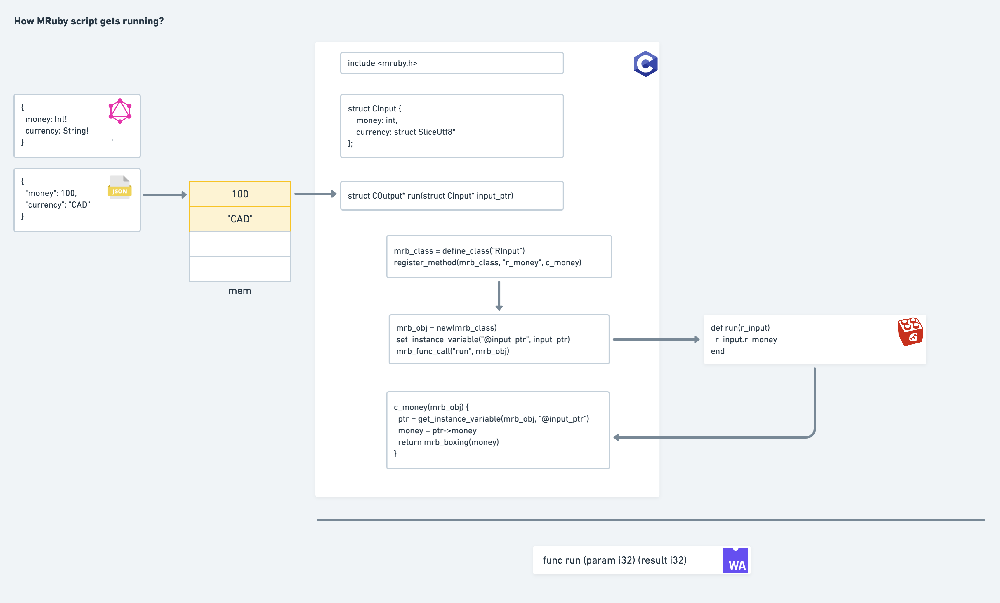

## Intro

This is a fork of [artichoke/artichoke](https://github.com/artichoke/artichoke), which we compile mruby
to wasm. All changes are in [mruby-sys/vendor/mruby-bc7c5d3/](./mruby-sys/vendor/mruby-bc7c5d3/). Please
cd into this directory first.

As we know, with the help of LLVM, we are able to compile a C program into WASM. So, what if the C
program does is to init a Ruby interpreter and run a Ruby script on it? Yeah, that's what we are doing
in this project. Practically, we are compiling a C program here. It includes a mruby interpreter, a Ruby script
and some glue code to transforming C values back and forth from the Ruby script execution.

`entry.c` is the main entry file. `test.schema` is the schema file, which is a copy of vanity pricing schema. To
make it running,

## How to run it

A precondition is to have LLVM correclty installed. If you are using a MacOS, this is how you should configure:

1. Use `clang --version` to check your current version
2. `brew install llvm`
  * add its path `/usr/local/opt/llvm/bin` to your `$PATH`
  * use `clang --version` to verifry that you are using the new version
  * check `$LDFLAGS`, which should be empty. Clear it if it's being set.
3. Check `which clang`, go to its bin file and soft link it to `clang-8`
4. Check `which wasm-ld`, go to its bin file and soft link it to `wasm-ld-8`

Nice. Go init Runtime Engine now (in release mode, by `env MEMCACHED_SERVERS=runtime-engine.railgun cargo run --release`)

Compile, deploy and run by `./run`
