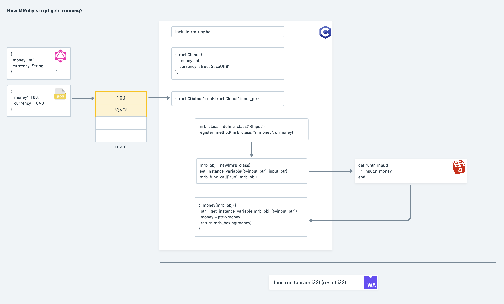

## Intro

As we know, with the help of LLVM, we are able to compile a C program into WASM. So, what if the C
program does is to init a Ruby interpreter and run a Ruby script on it? Yeah, that's what we are doing
in this project. Practically, we are compiling a C program here. It includes a mruby interpreter, a Ruby script
and some glue code to transforming C values back and forth from the Ruby script execution.



## Workable script

### Vanity pricing

+ entry file: [entry_vanity_pricing.c](./entry_vanity_pricing.c)
+ schema: [test.vanity_pricing.schema](./test.vanity_pricing.schema)
+ mruby script is embedded in entry file

### Discount

+ entry file: [entry_discount.c](./entry_discount.c)
+ schema: [test.discount.schema](./test.discount.schema)
+ mruby script: [discount.rb](./discount.rb)

## How to run it

**Precondition**

A precondition is to have LLVM correclty installed. If you are using a MacOS, this is how you should configure:

1. Use `clang --version` to check your current version
2. `brew install llvm`
  * add its path `/usr/local/opt/llvm/bin` to your `$PATH`
  * use `clang --version` to verifry that you are using the new version
  * check `$LDFLAGS`, which should be empty. Clear it if it's being set.
3. Check `which clang`, go to its bin file and soft link it to `clang-8`
4. Check `which wasm-ld`, go to its bin file and soft link it to `wasm-ld-8`

Nice. Go init Runtime Engine now (in release mode, by `env MEMCACHED_SERVERS=runtime-engine.railgun cargo run --release`).
The current version of engine is at [acfabda](https://github.com/Shopify/runtime-engine/commit/acfabda747a3f9b8e0615a4728fc46706b299b4b)

**Run**

* Copy the entry to `entry.c` and schema file to `test.schema`
* Compile, deploy and run by `./run`

## Development notes

There are some weird cases for mruby code, which can be compiled but will run into the `unreachable` error on engine.

```
# case 1 - nested array in a hash
ha = {}
ha[1] = []
ha[1] << 1

# case 2 - count on array and hash
ha.count # ha.keys.count

# case 3 - break
[1,2,3].each do |I|
  ..
  break # it’s is not working
end
```
